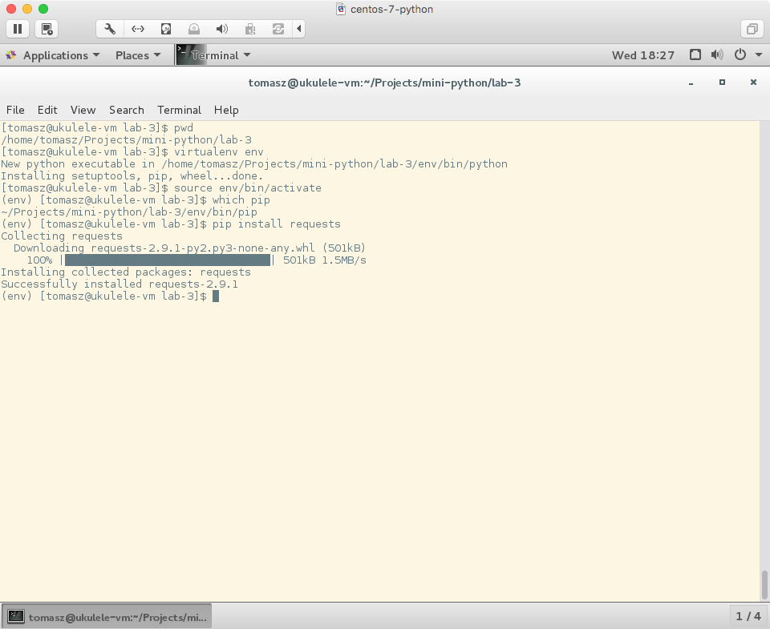
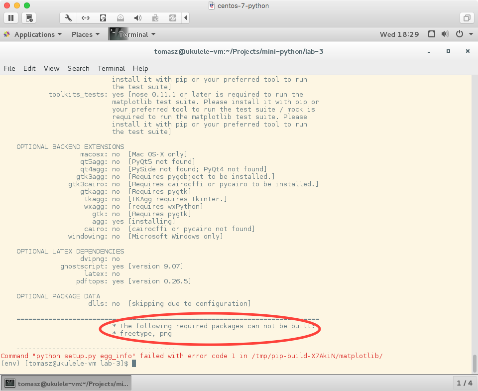
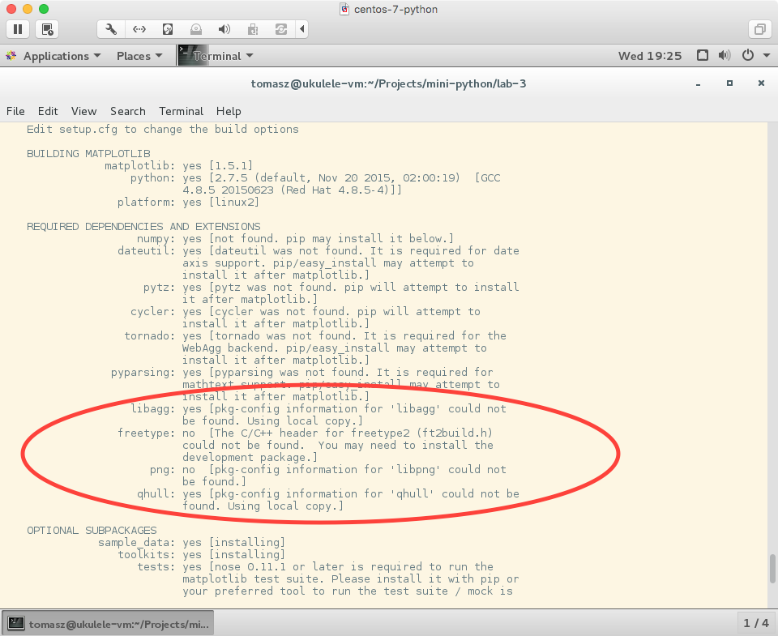
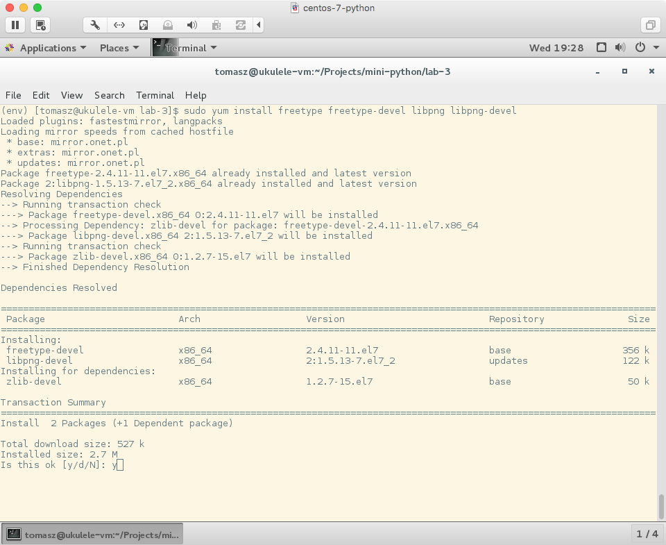
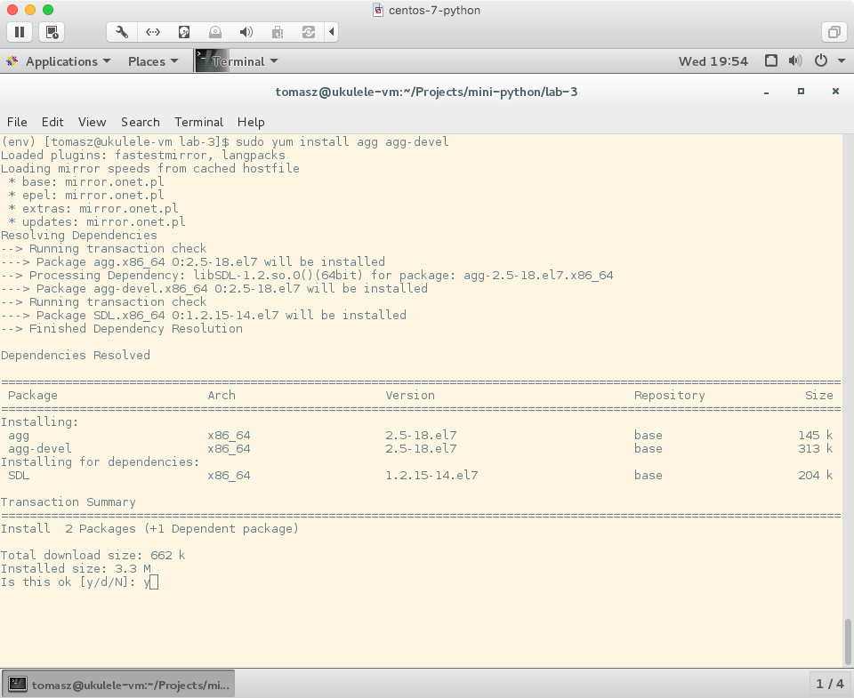
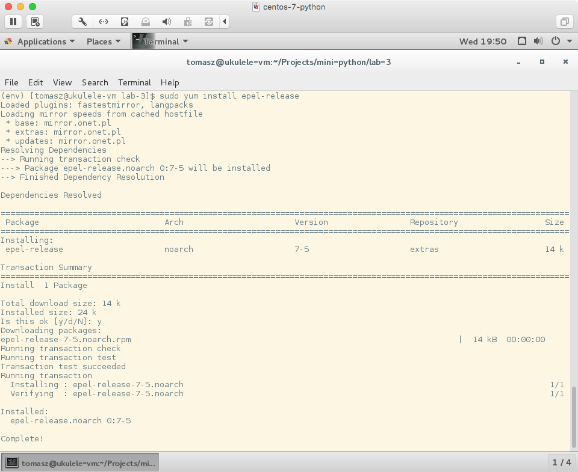
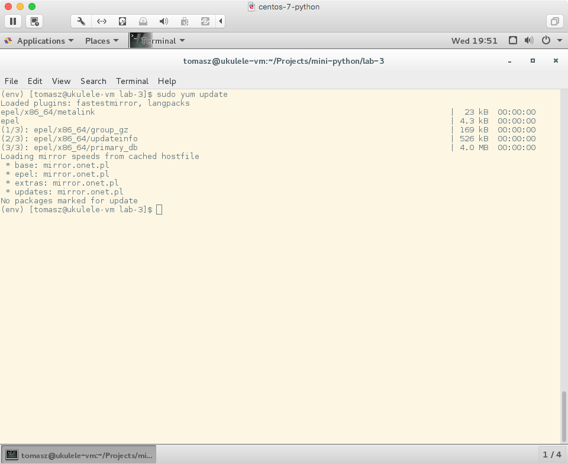
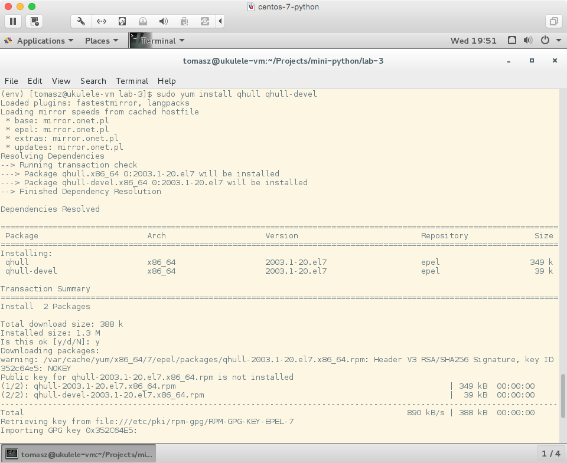
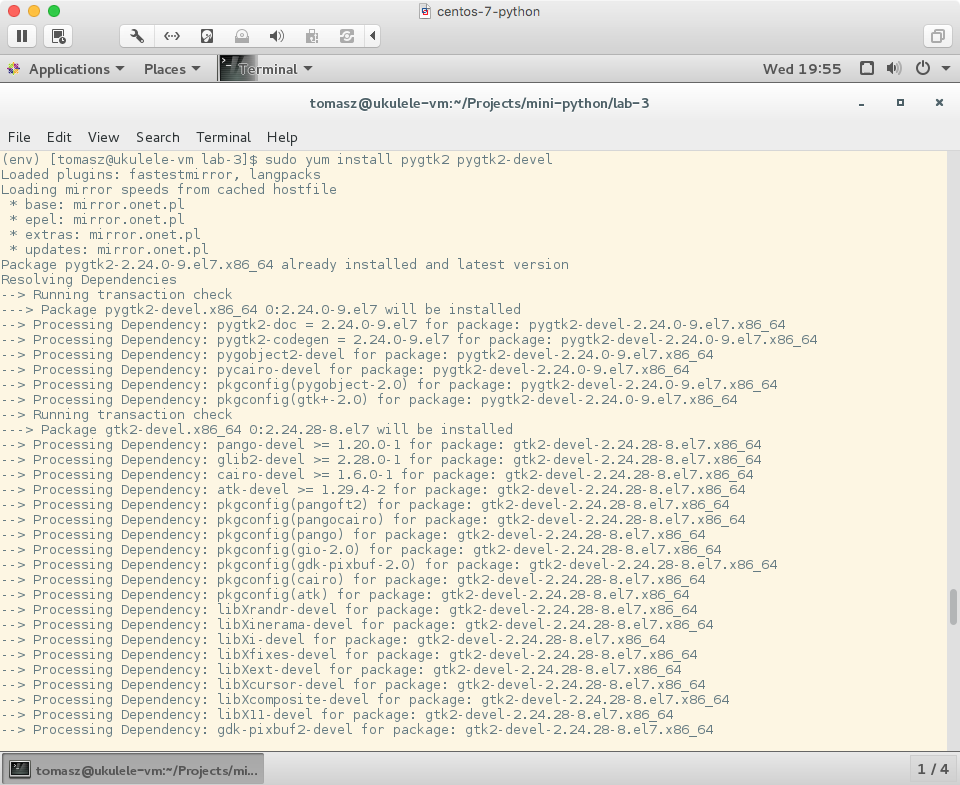
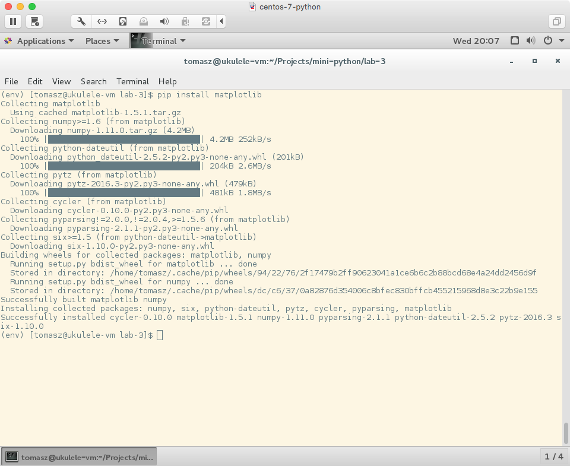

## Instalcja `matplotlib` na CentOS 7 pod `virtualenv`

OK. Cała sprawa błędu instalacji wynika z niespełnienia zależności w pakietach systemowych i jego rozwiązanie wymagało po prostu przeczytania co się wydrukowało. Aby uprościć całą sprawę, możemy po prostu zainstalować systemowy pakiet `python-matplotlib` i mieć problem z głowy. Ale nie na tym polega ta zabawa, żeby było łatwo, que no?

### Stworzenie środowiska wirtualnego

Przechodzę do katalogu projektu, tworzę środowisko wirtualne Pythona, aktywuję  nowe środowisko, sprawdzam czy faktycznie działa i instaluję pakiet `requests`. Żadna z tych komend nie powinna być dla Ciebie czymś nowym:

```text
$ mkdir -p Projects/mini-python/lab- 3
$ cd Projects/mini-python/lab-3
$ virtualenv env
$ source env/bin/activate
(env) $ pip install requests
```


Wszystko działa jak należy. Następnie próbuję zainstalować pakiet `matplotlib`:

```text
(env) $ pip install matplotlib
```

### Instalacja brakujących zależności

Dostaję bardzo ogólny komunikat, że skrypt instalacyjny zakończył swoją pracę z kodem `1`. Na systemach zgodnych z POSIXem, gdy program kończy pracę z kodem innym niż `0`, to znaczy, że zakończył pracę z błędem. Staram się doczytać coś więcej o błędzie, zwłaszcza, że skrypt wydrukował mnóstwo informacji.




Instalator od razu daje nam znać, że nie nie jest w stanie sam zainstalować pakietów `freetype` i `png`. Przewijam ekran wyżej i znajduję listę wszystkich wymaganych zależności `matplotlib`. Widzimy, że pakiety `libagg` oraz `qhull`, są potrzebne i nie będą instalowane przez `pip`. Pozostałymi się nie przejmuję, ponieważ zostaną zainstalowane przez `pip` automatycznie.

Mamy więc cztery pakiety systemowe, które chcemy zainstalować przed instalacją `matplotlib`. Są to `freetype`, `png`, `libagg` i `qhull`. Sprawa z przedrostkiem `lib*` w nazwach pakietów systemowych \*nixów nie jest unormowana. Tak jak ten skrypt instalacyjny szukał pakietu `png`, to w repozytorium CentOS jest on znany jako `libpng`. Z kolei `libagg` jest znane jako `agg`. Dlaczego tak jest, to mnie nie pytaj. W każdym razie, zainstalujmy te pakiety. Zauważ, że będziemy od razy instalować pakiety właściwe oraz ich dodatkowe pakiety deweloperskie. Pakiety deweloperskie zawierają headery i pliki wymagane podczas kompilacji innych projektów zależnych od nich.

```text
$ sudo yum install -y freetype freetype-devel libpng libpng-devel agg agg-devel
```



Jest mały problem z pakietem `qhull`, ponieważ nie ma go w standardowym repozytorium CentOS'a. Szybki Google, mówi, że pakiet ten znajdziemy w EPEL.

EPEL jest dodatkowym repozytorium pakietów systemowych dla systemów opartych na Red Hat. Zawiera pakiety, którymi nie chcą lub nie mogą z powodu licencji zajmować się te dystrybucje Red Hata. Zainstalujemy więc informacje o tym nowym repozytorium, zaktualizujemy `yum` i zainstalujemy pakiet `qhull` oraz jego pliki deweloperskie `qhull-devel`:

```text
$ sudo yum install -y epel-release
$ sudo yum update
$ sudo yum install -y qhull qhull-devel
```




Podczas ostatniego kroku `yum` dodatkowo spyta, czy na pewno ufamy pakietom z nowego repozytorium, na co się zgadzamy.

Pakiet `matplotlib` służy do rysowania różnych grafik, i jeżeli się cofniemy wcześniej do logów skryptu instalacyjnego, możemy zauważyć, że przed kompilacją, instalator sprawdza jeszcze jakie technologie są dostępne do rysowania. Korzystamy z GNOME, opartym na Gtk. By `matplotlib` mógł skorzystać z rysowania za pomocą Gtk, powinniśmy mu zainstalować Pythonowe bindingi do Gtk. Można to zrobić przez `pip`, ale jest to pakiet tak ściśle zależny od innych pakietów systemowych, że lepiej zostawić kontrolę nad jego wersją i zależnościami `yum`, niż `pip`. Ponownie zainstalujemy pakiet właściwy `pygtk2` oraz jego dodatkowe pliki deweloperskie `pygtk2-devel`:

```text
$ sudo yum install -y pygtk2 pygtk2-devel
```


### Instalacja `matplotlib`

Zainstalowaliśmy już wszystkie wymagane zależności dla `matplotlib`. Jak wspomniałem, zależności czysto Pythonowe będą zainstlowane przez `pip`, więc nimi się nie interesowaliśmy.

```text
(env) $ pip install matplotlib
```


Ta instalacja trochę trwa. Sporo rzeczy jest w tle kompilowane. Teraz już przynajmniej, skrypt instalacyjny wszystko powinno znaleźć i z powodzeniem zainstlować.

Na koniec pamiętaj by deaktywować środowisko wirtualne:

```text
(env) $ deactivate
$
```
