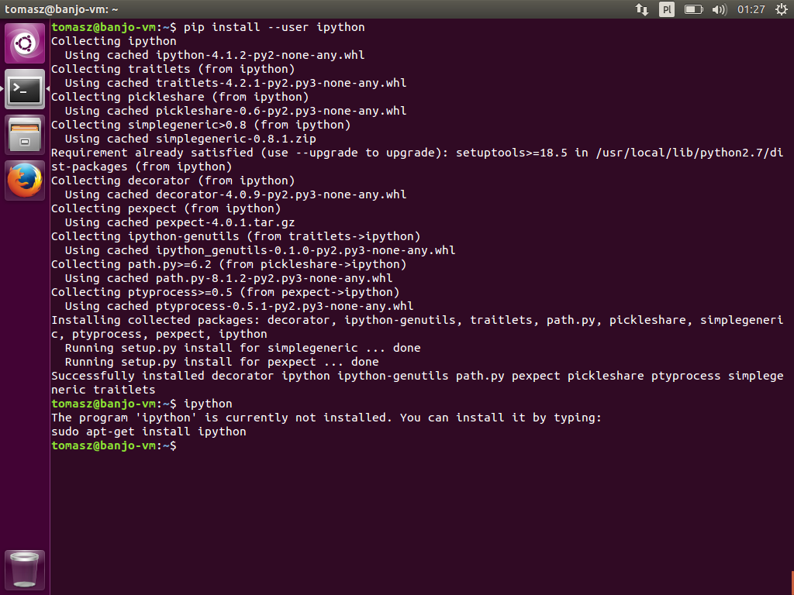
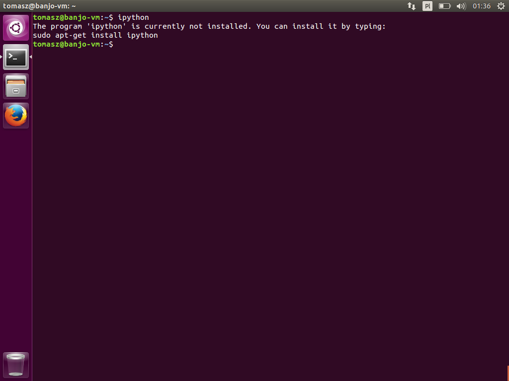
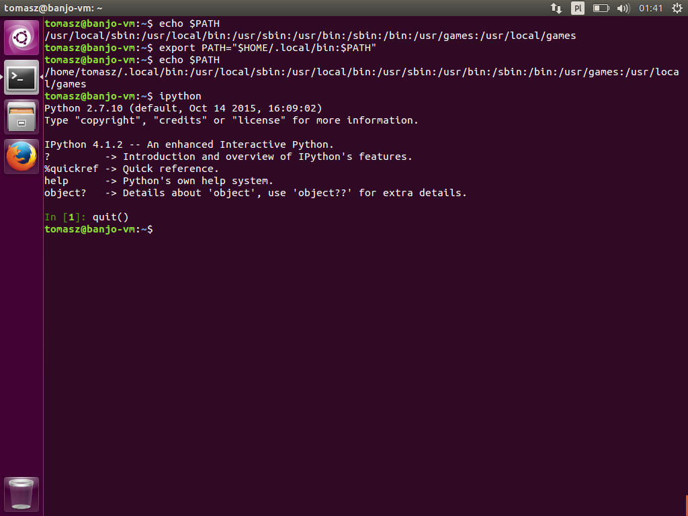

## Instalacja pakietów Pythona bez `sudo`

### Flaga `pip install --user`

Domyślnie `pip` będzie próbował zainstalować wszystkie pakiety do ścieżek gdzie jest zainstalowany Python, z którego korzystamy wywołując komendę `python`. W naszym przypadku, korzystamy z Pythona dostarczonego przez system, czyli będą to ścieżki systemowe, należące do użytkownika _root_.

Wywołując `pip install` można wymusić instalację pakietów wewnątrz katalogu domowego użytkownika poprzez przekazanie flagi `--user`, na przykład:

```text
// bez *sudo*
$ pip install --user ipython
```


Ale gdy spróbujemy uruchomić `ipython` najprawdopodobniej nam się to nie uda.

```text
$ ipython
```


Dzieje się tak, ponieważ program, który chcemy uruchomić, nie został zainstalowany w standardowej ścieżce systemowej, tylko jak wspomniałem, wewnątrz naszego katalogu domowego, a dokładnie w katalogu `~/.local/bin`. By móc skorzystać z programów zainstalowanych w ten sposób musimy poinformować system operacyjny, że te programy się tam znajdują. Służy do tego zmienna środowiskowa `$PATH`, którą musimy zaktualizować.

```text
$ export PATH="$HOME/.local/bin:$PATH"
```


Jest to z pewnością podejście bezpieczniejsze, ale wciąż posiada wady w postaci:

- możliwych problemów ze ścieżkami podczas importowania pakietów,
- możliwych i bardzo prawdopodobnych problemów z aktualizacją pakietów i rozbieżnością wersji wymaganej w projekcie, a wersją zainstalowaną,
- nadpisywanie różnych wersji pakietów w ścieżkach systemowych, z pakietami zainstalowanymi w katalogu domowym.

Ogólnie, zarządzanie zależnościami w pakietach jest problematyczne samo z siebie. Im mniej skomplikowań w naszym środowisku wprowadzimy, tym lepiej. Dlatego powstał `virtualenv`, o którym jest [następny dokument](instalacja-pakietow-pythona-z-virtualenv.md).
