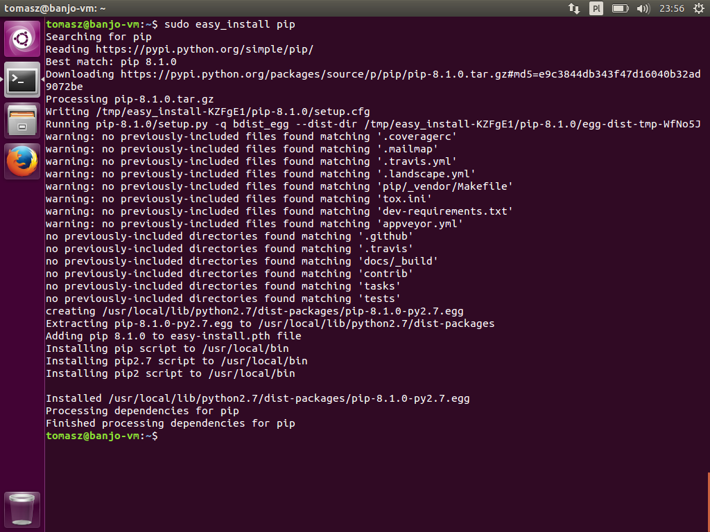
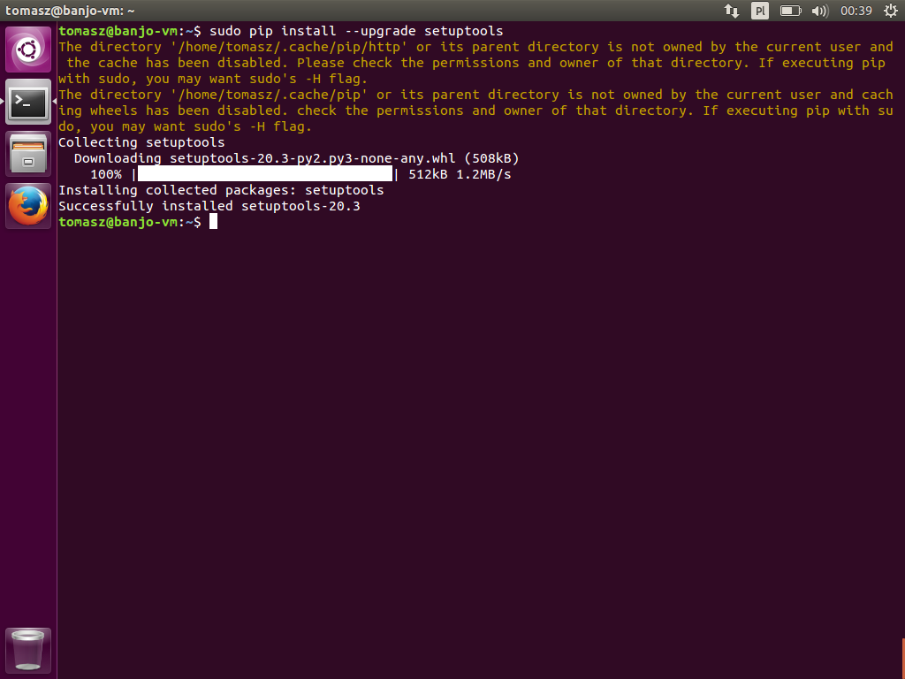

## Instalacja pakietów Pythona z `sudo`

Społeczeństwo Pythona używało kilku różnych menadżerów pakietów. Wcześniej służył do tego `easy_install`, którym instalowało się pakiety przygotowane w [`setuptools`](http://pythonhosted.org/setuptools/), którym generowało się [`Python Egg`](http://python-packaging-user-guide.readthedocs.org/en/latest/glossary/#term-egg).

Aktualnie używa się do tego celu [`pip`](https://pip.pypa.io/en/stable/), którym instalujemy pakiety spakowane w formacie [`Python Wheel`](http://pythonwheels.com/). Porównanie `easy_install` i `pip` [pokazuje dlaczego warto przejść na `pip`](http://python-packaging-user-guide.readthedocs.org/en/latest/pip_easy_install/). Kolejne argumenty za korzystaniem z `pip` można przeczytać w [tych odpowiedziach na Stack Overflow](http://stackoverflow.com/a/30408520/355800).


### Instalacja i aktualizacja `pip`

Poniższe kroki pewnie będą się różnić pomiędzy dystrybucjami i bardzo zależą od konfiguracji środowiska systemu operacyjnego. W szczególności od tego czy używamy Pythona zainstalowanego z pakietu systemowego, czy zainstalowanego ze źródeł dla użytkownika. Mimo to kroki te dadzą ogólny pogląd co należy zrobić by uzyskać działający `pip`. W większości przypadków `pip` będzie też już działał out-of-box.

Zakładam, że wasza instalacja Pythona jest zupełnie goła. By zainstalować `pip` należy wywołać:

```text
$ sudo easy_install pip
```


Jak wspomniałem wcześniej, program `easy_install` jest bardzo prostym (i starym) narzędziem do instalacji gotowych pakietów Pythona, stworzonych za pomocą `setuptools`. Teraz zainstalowaliśmy nowszy, powszechnie używany manager pakietów Pythona `pip`. Program `easy_install` jest częścią `setuptools`. Używamy `sudo` ponieważ jeszcze działamy na poziomie systemowej instalacji Pythona.

Teraz możemy już skorzystać z zainstalowanego `pip` by zaktualizować `setuptools`. Tę komendę chcemy wywołać z uprawnieniami _root_, ponieważ będziemy nadpisywać starą wersję `setuptools` zainstalowaną przez menadżer pakietów systemowych.

```text
$ sudo pip install -U setuptools
```


W przyszłości, co jakiś czas będziemy chcieli zaktualizować zainstalowane pakiety, w tym również sam `pip`. Można to zrobić wywołując:

```text
$ sudo pip install --update pip
```

lub korzystając ze skrótu:

```text
$ sudo pip install -U pip
```

### Instalacja pozostałych pakietów

Wszystkie pakiety Pythona możemy zainstalować korzystając z polecenia:

```text
$ sudo pip install <nazwa_pakietu>
```

Pakiety zainstalowane w ten sposób będą zainstalowane w ścieżkach systemowych, i będą dostępne dla wszystkich użytkowników systemu operacyjnego. Dawanie `pip` uprawnień _root_ [nie jest dobrą praktyką](http://stackoverflow.com/a/21056000/355800). Jeżeli mimo wszystko ufasz instalowanym przez siebie pakietom, taka forma używania `pip` jest najprostsza. Bezpieczniejszą wersją jest korzystanie z `pip`, bez nadawania mu uprawnień _root_. Można to zrobić wykorzystując pakiet `virtualenv`, który współpracuje bezproblemowo z `pip` i jest opisany [w następnym dokumencie](instalacja-pakietow-pythona-z-virtualenv.md).
