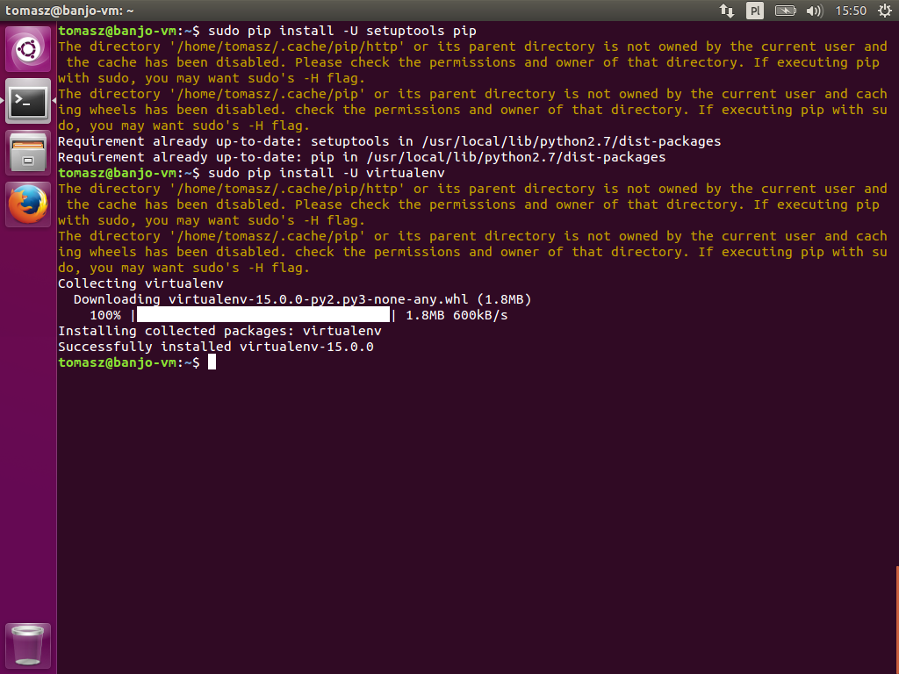
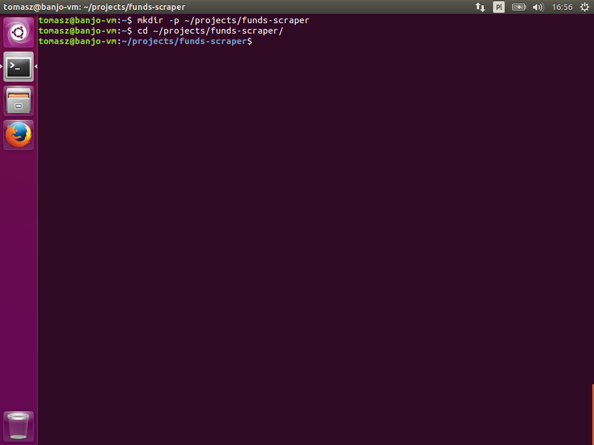
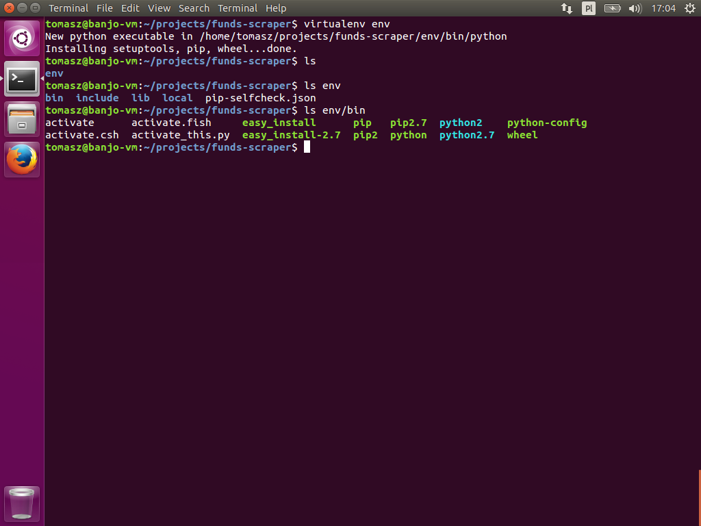
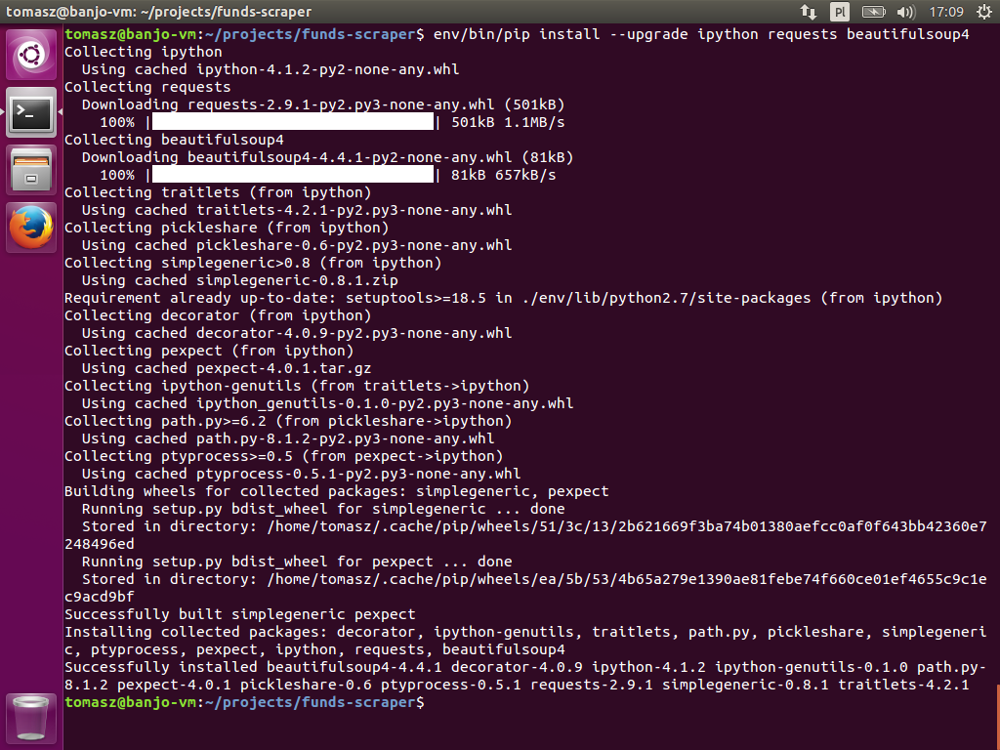
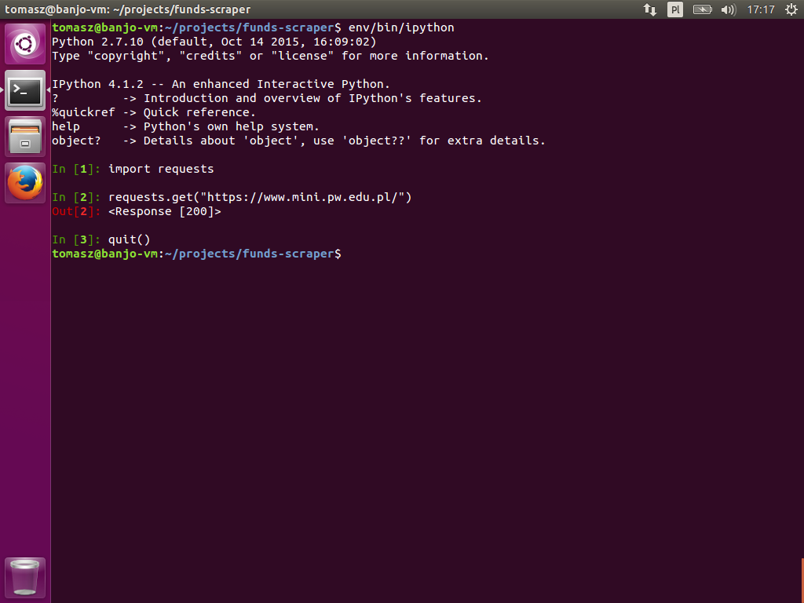
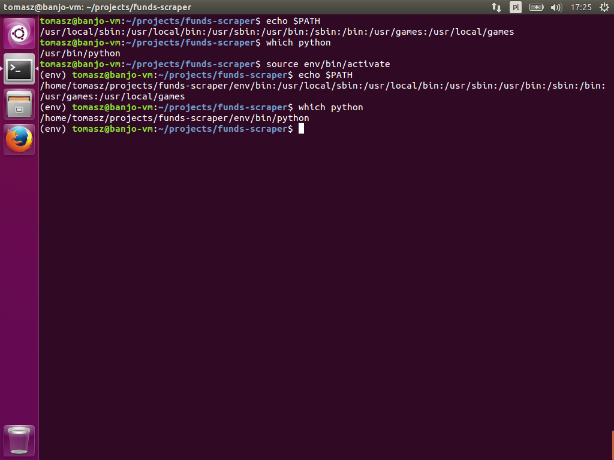

## Instalacja pakietów Pythona z `virtualenv`

[`virtualenv`](https://virtualenv.pypa.io/) to narzędzie tworzące wyizolowane instalacje Pythona. Używamy go na potrzeby każdego, pojedynczego projektu.

Dzięki temu jesteśmy w stanie prowadzić na jednej maszynie kilka projektów w Pythonie, i mieć dla każdego z nich zainstalowane wszystkie zależności w pełni oddzielone od zależności innych projektów. Unikamy w ten sposób powstawania konfliktów w zainstalowanych wersjach, podczas instalacji nowych pakietów lub ich aktualizacji. Dodatkowo wszystkie niezbędne do uruchomienia projektu binarki i pakiety Pythona są zainstalowane w ściśle określonym przez nas miejscu, nad którym mamy pełną kontrolę.

Zaktualizujmy `pip` i `setuptools` i zainstalujmy `virtualenv`. Jeszcze z uprawnieniami _root_, ponieważ chcemy mieć do niego dostęp w całym systemie.

```text
$ sudo pip install --upgrade setuptools pip
$ sudo pip install --upgrade virtualenv
```


### Przykład użycia `virtualenv` w projekcie

Załóżmy, że piszemy projekt ściągający dane o funduszach inwestycyjnych i drukujący te dane do ładnie sformatowanego pliku CSV. Będziemy potrzebować pakietów [`requests`](http://docs.python-requests.org/en/master/), [`BeautifulSoup4`](http://www.crummy.com/software/BeautifulSoup/bs4/doc/) i `iPython` do ewentualnego debuggowania.

Najpierw stwórzmy katalog dla projektu:

```text
$ mkdir -p ~/projects/funds-scraper
$ cd ~/projects/funds-scraper/
```


Teraz stworzymy wirtualną instalację Pythona na potrzeby naszego projektu i zainstalujemy ją w katalogu `env/` wewnątrz katalogu projektu.

```text
$ virtualenv env
```


Jak widać `virtualenv` stworzył katalog `env/`, który zawiera szkielet struktury katalogów systemowych. W katalogu `env/bin/` znajdują się pliki wykonywalne interpretera Pythona -- `python` oraz `pip`. To właśnie ich chcemy używać pracując nad naszym projektem.

Zainstalujmy nasze zależności projektu. Jak wspomniałem, chcemy teraz używać 
`pip` z naszej nowej, wirtualnej instalacji Pythona:

```text
$ env/bin/pip install ipython requests beautifulsoup4
```


Wszystko zostało zainstalowane bez problemy. Chcemy sprawdzić, czy faktycznie działa. Ponownie, musimy być pewni, że używamy binarek z naszej wirtualnej instalacji Pythona, więc odwołujemy się bezpośrednio:

```text
$ env/bin/ipython
```


Widzimy, że udało się uruchomić `ipython`, a nawet udało się zaimportować i użyć bibliotekę `requests`. Świetnie!

Ale to ciągłe używanie pełnej ścieżki do binarek w końcu zacznie nas denerwować. `virtualenv` też ma na to sposób. W katalogu `env/bin/` znajduje się skrypt `activate`. Jest to skrypt dla powłok pochodnych od Bourne Shell, w tym też `bash`, którego domyślnie używamy na Ubuntu. Jest on wygenerowany przez `virtualenv`. Skrypt konfiguruje zmienną środowiskowej `PATH`, tak byśmy mogli, w wygodny sposób, korzystać z naszej wirtualnej instalacji Pythona, a nie instalacji systemowej. Aby go uruchomić należy wywołać:

```text
$ source env/bin/activate
```


Jak widać na powyższym zrzucie, po załadowaniu skryptu `env/bin/activate`, zmianie uległy zmienna `PATH` jak i ścieżka do interpretera Pythona.

Teraz możemy korzystać z `pip`, `python` czy  `ipython` tak jak byśmy używali ich normalnie, tylko że wszystko będzie zawarte w naszej wirtualnej instalacji Pythona z katalogu `env/`.

Gdy skończymy pracę nad projektem musimy pamiętać o powrocie do standardowych ustawień `PATH`. Służy do tego funkcja tworzona podczas wczytywania skryptu`activate`. Wystarczy wywołać:

```text
$ deactivate
```


i wszystko wróci do ustawień przed pracą nad projektem.

### Rozszerzenia i automatyzacja `virtualenv`

Istnieją narzędzia rozwijające funkcjonalność `virtualenv`, ale ich używanie nie jest wymagane w znajomości podstaw, więc są poza zakresem tych dokumentów. Wspomnę tylko o [`virtualenvwrapper`](https://virtualenvwrapper.readthedocs.org/en/latest/), który usprawnia pracę z `virtualenv`. Natomiast dowiedzieć się jak go używać i skonfigurować będzie zadaniem dla czytelnika.
