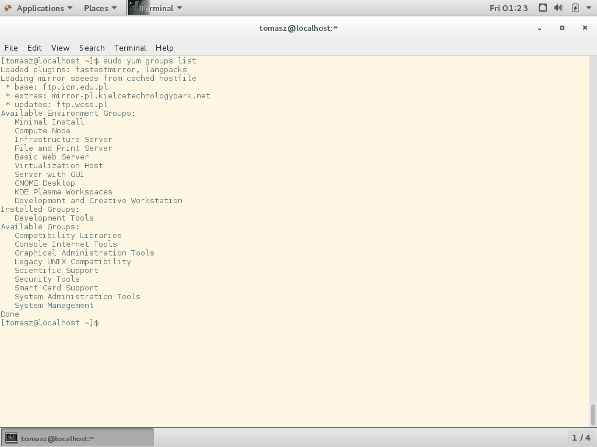

## Instalacja Python 2 na CentOS 7

Zaczniemy od aktualizacji pakietów systemowych poprzez wywołanie `sudo yum update`. Program `yum` jest menadżerem pakietów systemowych w dystrybucjach bazowanych na Red Hat. Jest analogiem programu `apt-get` z Debiana. Flaga `-y` w poniższej komendzie jest skrótem od `--assumeyes` i odpowiada akceptująco na pytania zadawane przez `yum` podczas aktualizacji.

```text
$ sudo yum -y update
```

Spróbujemy uruchomić Pythona i sprawdzić jaką wersję mamy zainstalowaną:

```text
$ python -V
```


Python w wersji 2.7.5 jest zainstalowany domyślnie w dystrybucji. Przejdźmy teraz do instalacji pakietów wymienionych w ramach postu o przygotowaniu systemu do pierwszych zajęć:

```text
$ sudo yum install python-setuptools python-dev build-essential
```


Widzę, że pakiet `python-setuptools` jest już zainstalowany. Gdyby nie był, można go zainstalować wywołująć komendę:

```text
$ sudo yum install -y python-setuptools
```

Pakiety `python-dev` i `build-essential` nie zostały rozpoznane przez `yum`. Sprawa z pakietem `python-dev` jest prosta. W przeciwieństwie do Ubuntu/Debianie w CentOS/Red Hat utarła się konwencja nazywania pakietów deweloperskich z postfixem `*-devel`, a nie `*-dev`. Należy więc wywołać poniższą komendę, by zainstalować `python-devel`:

```text
$ sudo yum install -y python-devel
```


Sprawa z pakietem `build-essential` jest bardziej zagmatwana. W Ubuntu/Debianie jest to meta-pakiet. Oznacza to, że pakiet nie zawiera żadnych plików, a jego jedynym celem jest złączenie w grupę kilku pakietów, które deklaruje jako zależności. Instalując go, instalujesz tę zadeklarowaną grupę pakietów, bez konieczności wpisywania nazwy każdego z nich z osobna.

W CentOS nie ma bezpośredniego odpowiednika dla meta-pakietu `build-essential`. W naszym przypadku, z pakietów instalowanych w ramach `build-essential`, potrzebny jest prawdopodobnie tylko `gcc` –- kompilator C i `libc` -- standardowa biblioteka C. W końcu Pythona jest napisany w C. ;) CentOS jak już wspomniałem nie zna pakietu `build-essential`, ani nie posiada bezpośredniego odpowiednika. Nie bawi się też w tanie sztuczki z pustymi meta-pakietami i po prostu posiada imienne grupy pakietów. Chcemy teraz zainstalować grupę pakietów o nazwie `Development Tools`. Zawiera dużo więcej systemowych pakietów niż `build-essential` na Ubuntu, ale prędzej czy później i tak będziemy chcieli mieć te pakiety zainstalowane. Jest spora szansa, że masz już tę grupę zainstalowaną. Możemy to sprawdzić poleceniem:

```text
$ sudo yum groups install -y "Development Tools"
```


Bardzo możliwe, że grupa była już zainstalowana z systemem. Można to zweryfikować wypisując listę statusów grup:

```text
$ sudo yum groups list
```


Jak widać, po instalacji, grupa `Development Tools` znajduje się w liście `Installed Groups:`.

Przejdźmy teraz do [instalacji pakietów Pythona](../instalacja-pakietow-pythona-z-sudo.md).
