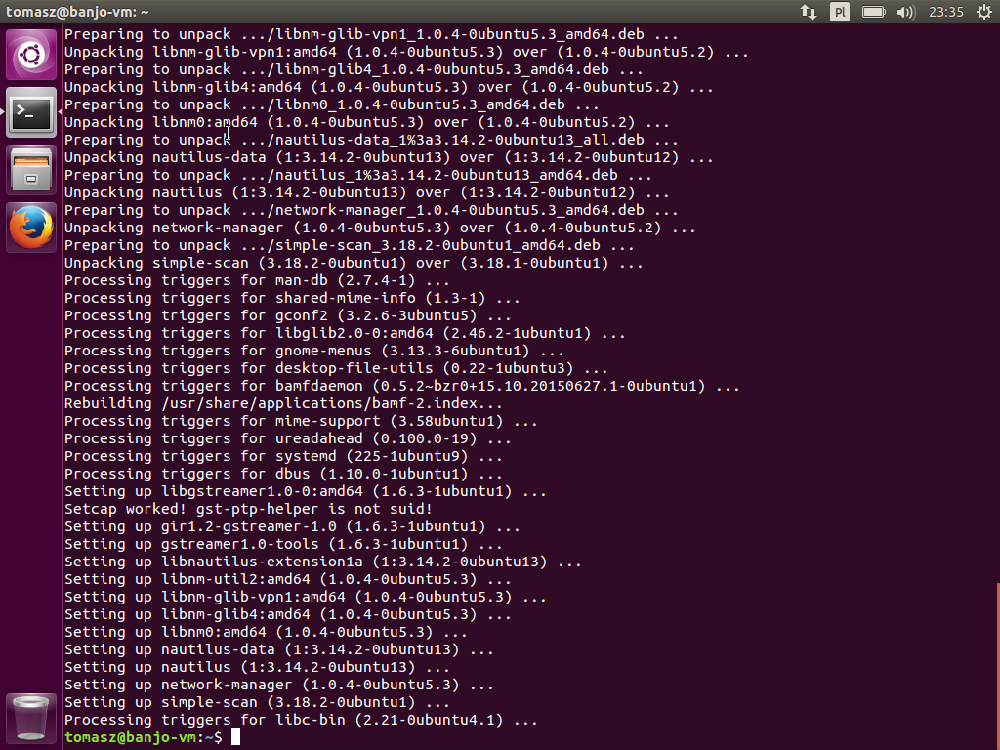

## Instalacja Pythona na Ubuntu 15.10

Poniższe kroki instalacji są wykonywane na świeżej instalacji Ubuntu 15.10. Na początku wykonujemy aktualizację pakietów systemowych. Służy do tego program `apt-get`. Jest to menadżer pakietów systemowych w dystrybucjach opartych na Debianie, którą jest Ubuntu:

```text
$ sudo apt-get update && sudo apt-get upgrade
```


Sprawdzam czy Python jest już zainstalowany:

```text
$ python --version
```


Domyślna instalacja Ubuntu posiada już zainstalowanego Pythona w wersji 2.7.10. Teraz zainstalujemy pakiety systemowe potrzebne do instalacji pakietów Pythona, wymienione w instrukcji przygotowania środowiska do pracy z Pythonem:

```text
$ sudo apt-get install python-dev python-setuptools build-essential
```


Właśnie kazaliśmi `apt-get` zainstalować trzy pakiety systemowe `python-dev`, `python-setuptools` i `build-essential`. Pakiety `python-dev` i `python-setuptools` są standardowymi pakietami systemowymi Ubuntu, które zawierają dodatkowe pliki potrzebne podczas instalacji pakietów Pythona wymagających kompilacji.

Z kolei pakiet `build-essential` jest meta-pakietem, który sam w sobie nie instaluje żadnych plików, natomiast deklaruje jako swoje zależności zbiór innych pakietów systemowych. Służy to ułatwieniu instalacji paru podstawowych narzędzi, często wykorzystywanych podczas kompilacji kodu w C. Niektóre pakiety Pythona posiadają natywne rozszerzenia w C, odwołujące się do systemu operacyjnego i wymagają kompilacji podczas instalacji. Instalujemy teraz te pakiety, by zabezpieczyć się na przyszłość.

Teraz korzystając ze starego (i **nie** używanego powszechnie) instalatora pakietów Pythona zainstalujemy nowoczesny, powszechnie używany menadżer pakietów Pythona:

```text
$ sudo easy_install pip
```


Teraz wykorzystamy nowy zainstalowany pakiet go by zaktualizował pakiet `setuptools`. W ten sposób nadpiszemy starszą wersję `setuptools` zainstalowaną wcześniej przez systemowe `apt-get`, wersją nowszą.

```text
$ sudo pip install --upgrade setuptools
```


Teraz mamy już w pełni zaktualizowane środowisko do pracy z Pythonem. Przejdźmy do [instalacji pakietów Pythona](../instalacja-pakietow-pythona-z-sudo.md).
