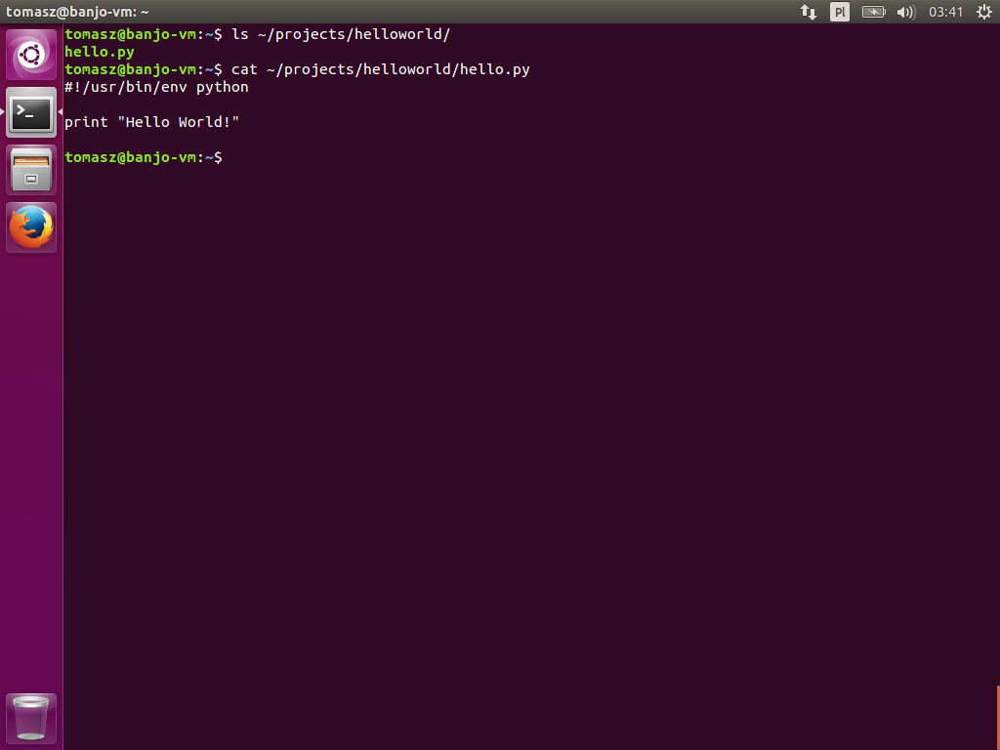
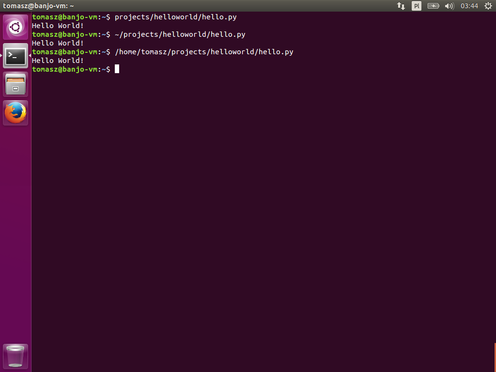
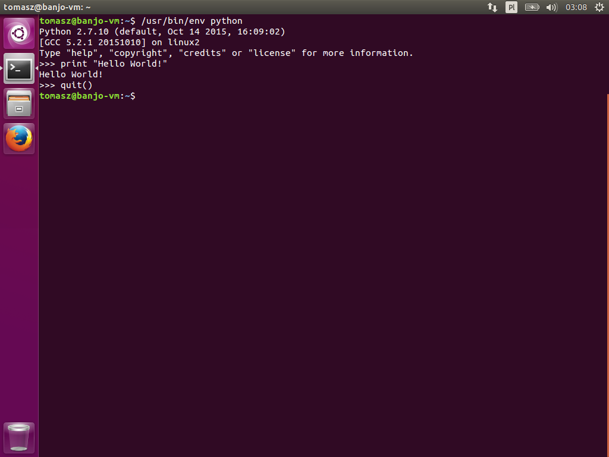
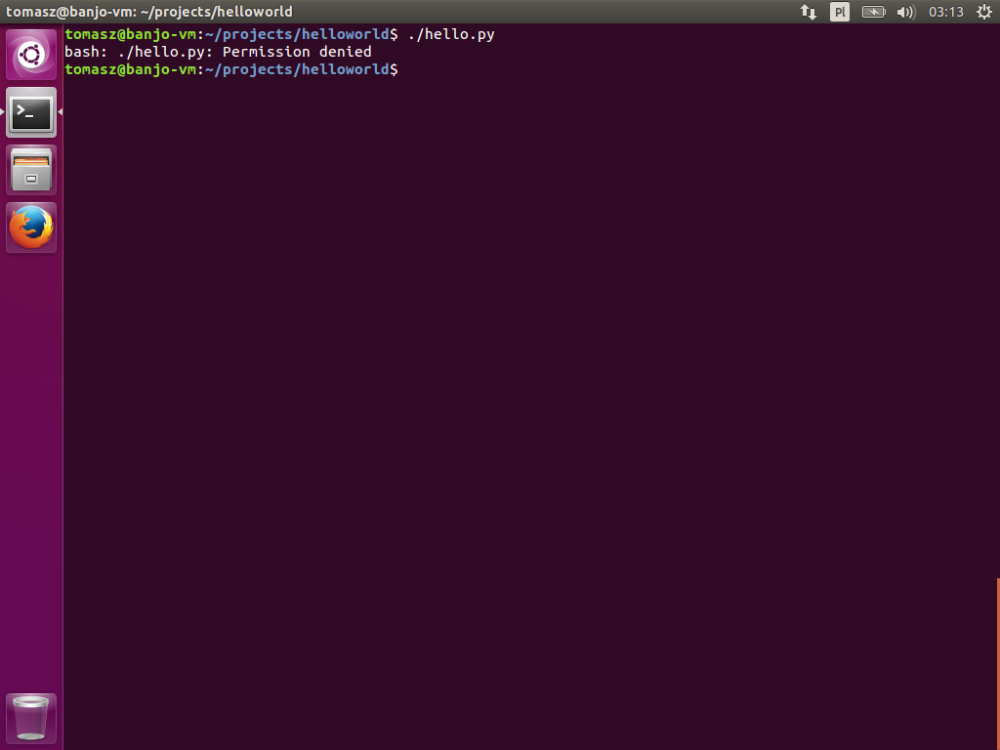
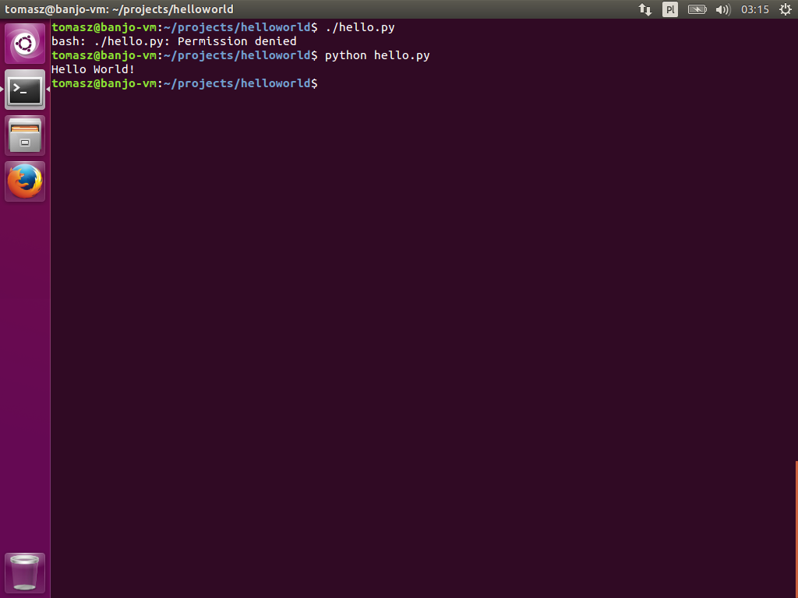
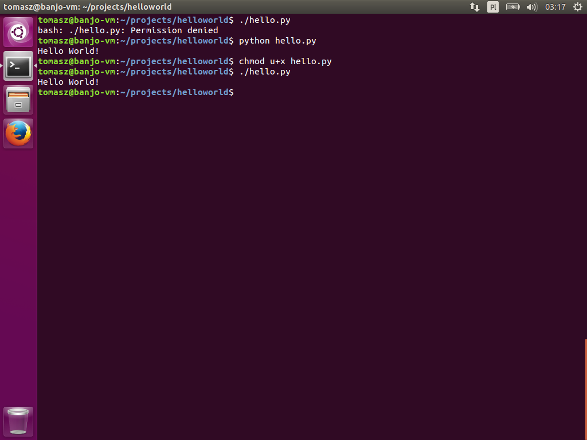

## Uruchamianie skryptów

W powłoce `Bash` uruchamianie plików odbywa się poprzez wprowadzenie w linii komend, ścieżki do pliku, który chcemy wykonać.

Załóżmy, że posiadamy skrypt Pythona drukujący linię *Hello World!* na wyjście standardowe. Skrypt, o nazwie `hello.py`, jest zapisany w katalogu `~/projects/helloworld/`.



Możemy go wykonać wpisując ścieżkę względną lub bezwzględną wskazującą na ten plik.

```text
$ projects/helloworld/hello.py
Hello World!
$ ~/projects/helloworld/hello.py
Hello World!
$ /home/tomasz/projects/helloworld/hello.py
Hello World!
```


Albo zmienić aktualny katalog, i uruchomić skrypt bezpośrednio z katalogu, w którym się znajduje. Wtedy trzeba użyć specjalnej ścieżki wykorzystującej symbol `.` "kropki". `.` oznacza bieżący katalog, w którym się znajdujemy. Z kolei dwie kropki `..` oznaczają katalog nadrzędny. Możemy zmienić bierzący katalog korzystając z komendy `cd`.


```text
$ cd projects/helloworld/
$ ./hello.py
Hello World!
$ cd ..
$ helloworld/hello.py
Hello World!
```


By móc wykonywać skrypty w ten sposób należy upewnić się, że są spełnione dwa warunki:

1. Obecny jest shebang.
1. Nasz użytkownik ma prawa wykonawcze na pliku.

### Shebang

Na samym początku pliku w pierwszej linii powinien znajdować się komentarz:

```python
#!/usr/bin/env python
```

Jest to [shebang](https://en.wikipedia.org/wiki/Shebang_\(Unix\)). Tego typu komentarz powinien być obecny w każdym pliku będącym wykonywalnym skryptem. Shebang daje informację systemowi operacyjnemu, którego interpretera skryptów ma użyć do wykonania instrukcji z tego pliku. Jest to polecenie systemowe, które otwiera domyślny, interaktywny shell Pythona. Jeżeli wywoła się treść shebanga bez `#!` z linii komend to uruchomiony zostanie interpreter Pythona:

```text
$ /usr/bin/env python
```


### Prawa wykonawcze

Drugą niezbędną sprawą, by uruchamianie przez `.` działało to nadanie praw wykonawczych (ang. *executable*) skryptowi, który chcesz uruchamiać.

Załóżmy, że napisałem skrypt w Pythonie, który chcę wywoływać z linii komend. Plik nazywa się `hello.py` i zawiera:

```python
#!/usr/bin/env python

print "Hello World!"
```


Po uruchomieniu tego skryptu powinienem zobaczyć wydrukowaną jedną linijkę tekstu `Hello World!`. Jednak, gdy spróbuję go teraz uruchomić to dostanę błąd, ponieważ nie mam praw wykonawczych na tym pliku. 

```text
$ ./hello.py
```


Mogę uruchomić ten skrypt przekazując ścieżkę do niego, bezpośrednio do interpretera Pythona.

```text
$ python hello.py
```


Albo nadać temu plikowi prawa wykonawcze i uruchomić go w standardowy sposób.

```text
$ chmod u+x hello.py
$ ./hello.py
```


By dowiedzieć się co dokładnie robi komenda `chmod u+x hello.py` przeczytaj [kolejny dokument](uzywanie-chmod.md).
