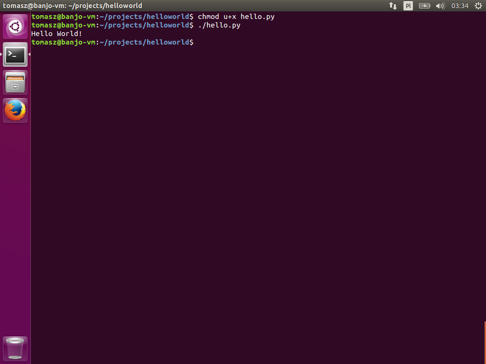

## Używanie `chmod`

Co dokładnie wykonuje komenda `chmod u+x hello.py`?

- `chmod` to program do zarządzania prawami odczytu, zapisu i wykonywania plików. Ponieważ w *nuxach, wszystko jest traktowane jak pliki, uprawnienia plików są fundamentalną częścią całego systemu.
- `u+x` jest instrukcją dla `chmod` mówiącą by użytkownikowi (`u` od *user*) posiadającemu wskazany plik, dodać (`+`) możliwość wykonywania pliku (`x` od *e**x**ecutable*).
- `hello.py` to ścieżka do pliku, którego prawa chcemy zmodyfikować.


Na zrzucie powyżej widać sytuację przed i po zmianie uprawnień. Uprawnienia pliku to pierwsza kolumna wyników z polecenia `ls -l`, które drukuje szczegółowe informacje o plikach, obecnych w bieżącym katalogu. Przed zmianą uprawnienia pliku wyglądały tak:

```text
-rw-rw-r--
```

Rozróżniamy trzy typy uprawnień:

- `r` -- `read`; Odczyt pliku. Sprawdzenie zawartości katalogu.
- `w` -- `write`; Pisanie/modyfikacja pliku. Tworzenia plików w katalogu.
- `x` od `execute`; Wykonanie/uruchomienie pliku. Otwarcie/wejście do katalogu.

Teraz warto zauważyć, że te trzy typy uprawnień są powtórzone trzy razy. Każda trójka jest przypisana różnych stopniom przynależności pliku. Spokojnie, brzmi źle, ale jest to banalnie proste. Każdy z plików ma jeszcze przypisaną informację, do którego użytkownika oraz do której grupy użytkowników należy. Są to odpowiednio trzecia i czwarta kolumna z wydruku polecenia `ls -l`. W naszym przypadku, plik `hello.py` należy do użytkownika `tomasz` i grupy użytkowników o nazwie `tomasz`.

1. `u` -- `user`; Pierwsza trójka praw `rw-` oznacza, że użytkownik, który jest właścicielem pliku może ten plik czytać, oraz do niego pisać, ale **nie** może go wykonywać.
1. `g` -- `group`; Druga trójka `rw-` mówi, że każdy użytkownik z grupy, do której należy plik, może go czytać i modyfikować, ale **nie** uruchamiać.
1. `o` -- `other`; Ostatnia trójka uprawnień dotyczy wszystkich pozostałych użytkowników systemu, i `r--` pozwala im tylko ten plik czytać, bez praw do modyfikacji i uruchamiania.

Po wywołaniu komendy `chmod u+x hello.py` uprawnienia pliku zmieniły się na

```
-rwxrw-r--
```

Zostało nadane prawo do wykonania pliku właścicielowi pliku, to znaczy, że nadaliśmy to prawo samemu sobie. Teraz wykonanie pliku daje oczekiwane rezultaty.


```text
$ ./hello.py
```

